# alpastx-dotfiles

Custom [Omarchy](https://omarchy.org) Quattro status bar setup: three rounded “island” bar sections (left, center, right), a centered taskbar, and a transparent top strip. Includes ten `alpastx.*` shell plugins, bar layout (`shell.json`), a `bluegirl` theme overlay, HackBench branding, and Hyprland animation/window rules from the same session.

**Not included:** stock `omarchy.*` widgets (menu, clock, workspaces, bluetooth, audio, etc.). Those ship with Omarchy; this repo only adds the custom plugins and the bar layout that references them.

## Screenshots

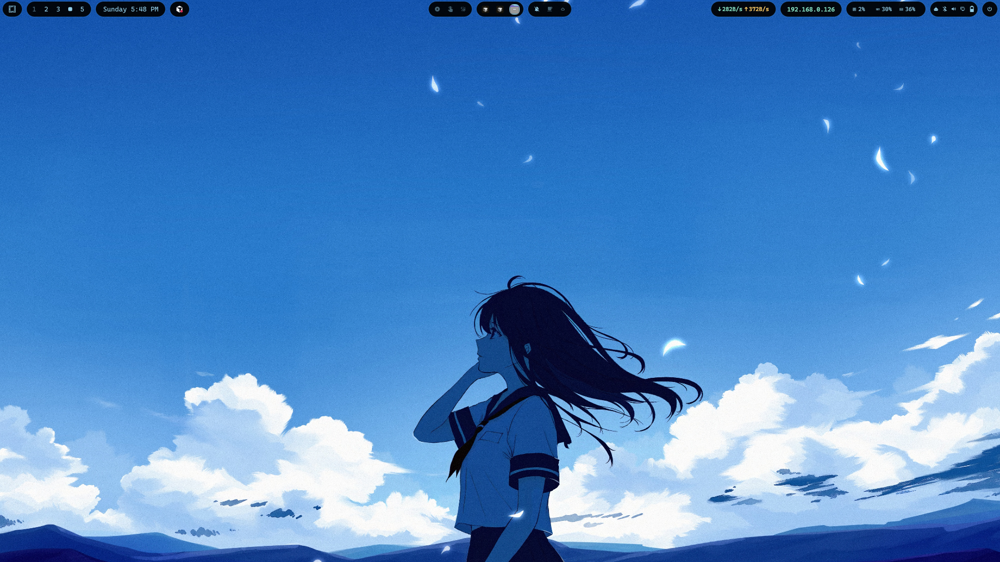


| Menu | Clock |
|------|-------|
| 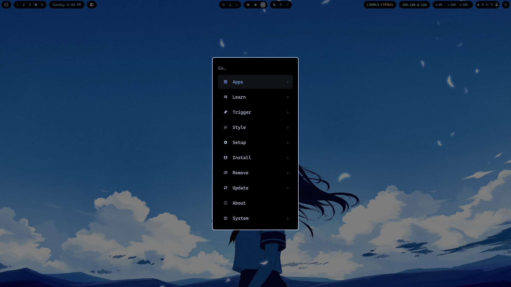 | 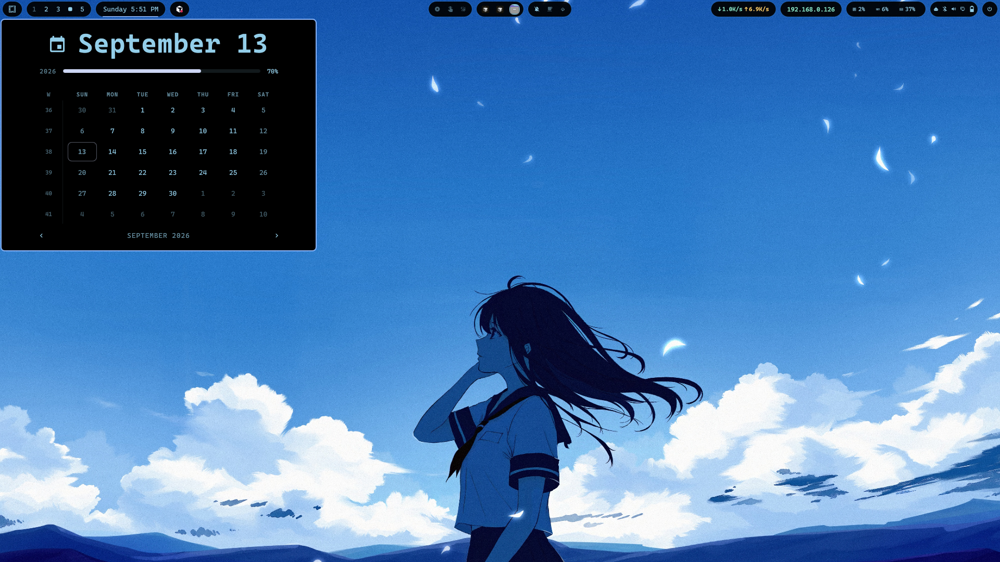 |
| **Weather** | **Network** |
| 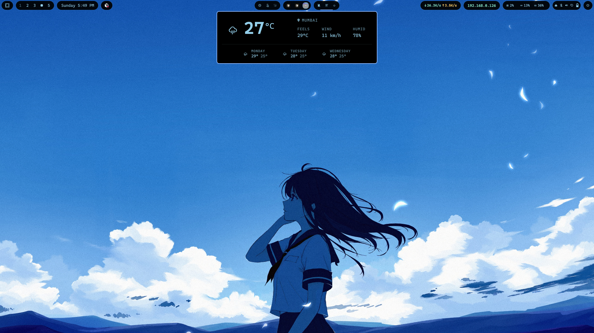 | 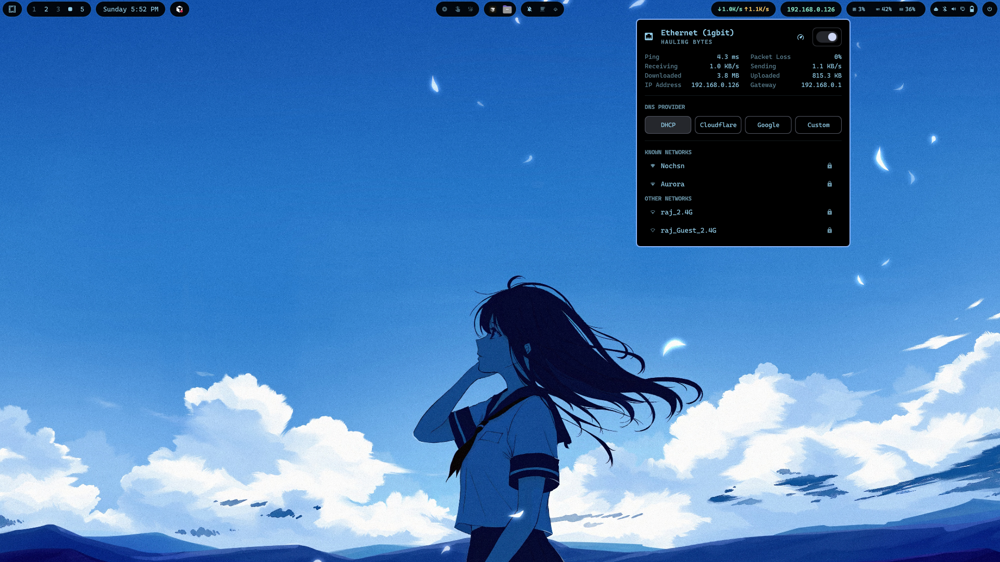 |
| **IP** | **Quadrant** |
| 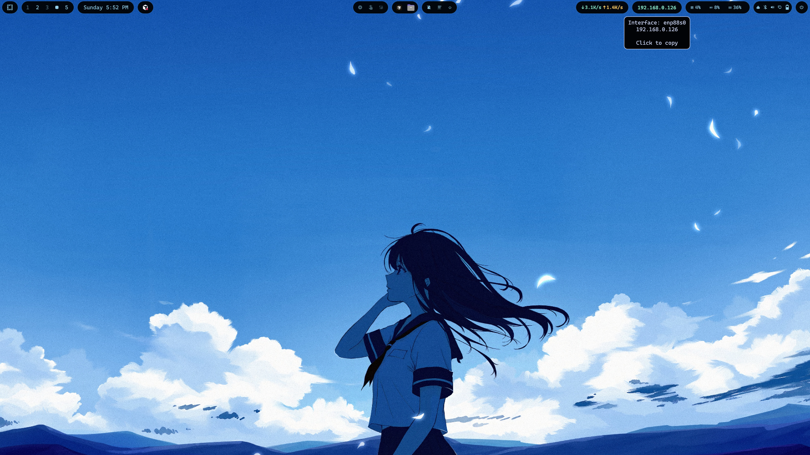 | 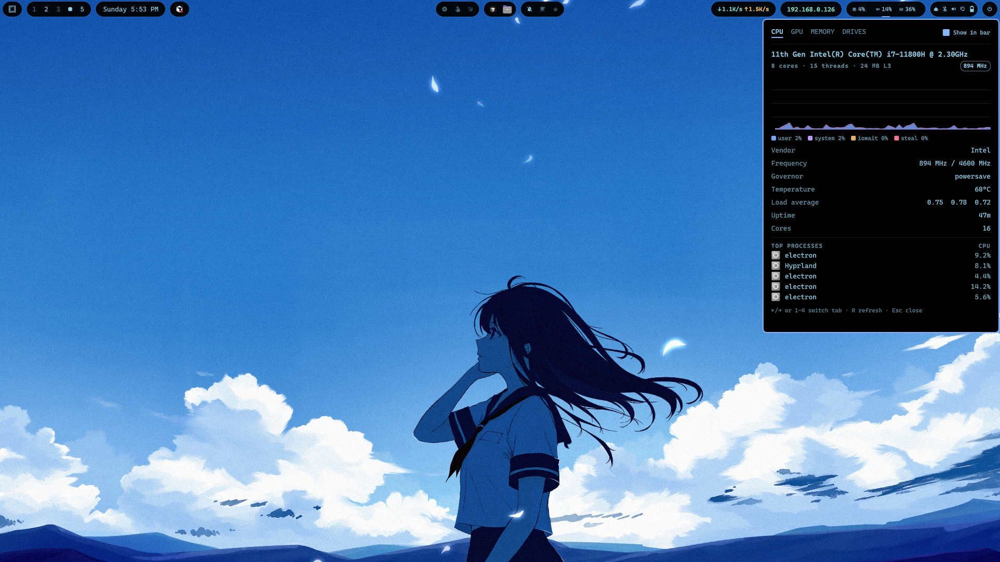 |
| **Bluetooth** | **Audio** |
| 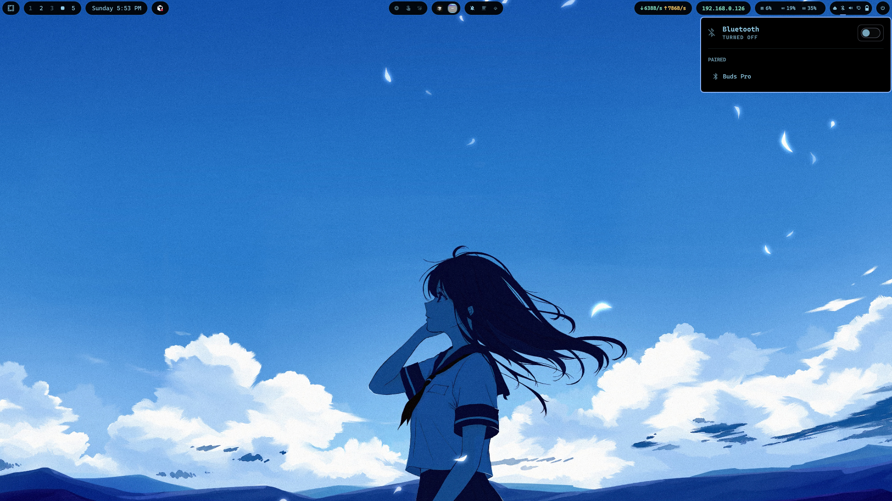 | 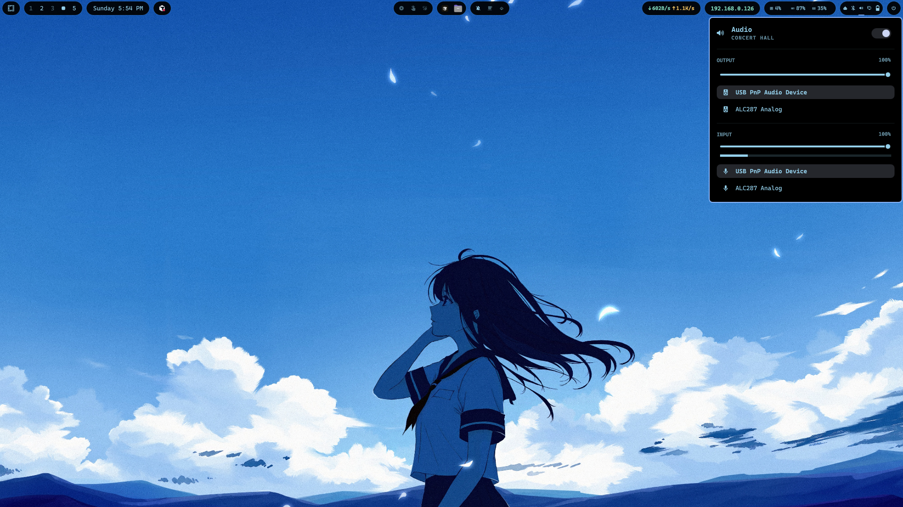 |
| **Display** | **Battery** |
| 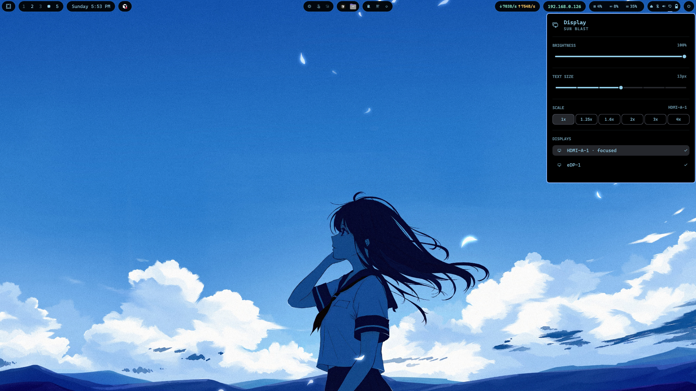 | 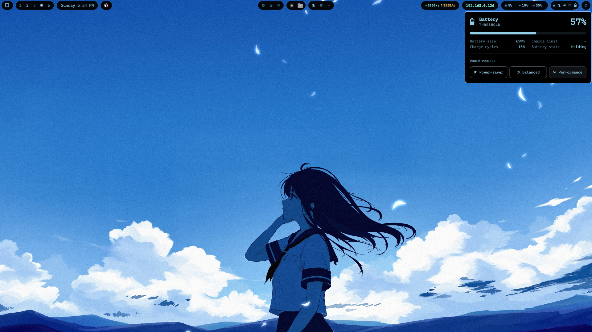 |

## Give this to an AI

Hand **[AGENTS.md](AGENTS.md)** to Cursor, Claude, Codex, or any other assistant. It tells the model how to install this repo safely on Omarchy without editing package files or wiping the bootloader config. Claude Code also reads `CLAUDE.md`, which points at the same file.

## Requirements

- **Omarchy 4** (Quattro shell)
- **Hyprland** (for `looknfeel.lua` animations and window rules)
- **jq** and **bash** — used by `alpastx.quadrant` sampler scripts
- **NetworkManager** — `alpastx.network` Wi‑Fi panel
- **curl** (optional) — `alpastx.weather` forecast fetch
- Nerd Font icons in the bar (theme / Omarchy default)

## Quick install

```bash
cd ~/Desktop/alpastx-dotfiles   # or wherever you cloned this repo
chmod +x install.sh
./install.sh
```

The installer:

1. Backs up existing `~/.config/omarchy` (timestamped) if present
2. Symlinks `shell.json` and `hypr/looknfeel.lua` into `~/.config`
3. **Copies** plugin folders into `~/.config/omarchy/plugins/` (Omarchy rejects symlinks inside plugins)
4. Copies the `bluegirl` theme overlay
5. Copies `omarchy/branding/` (screensaver, about, HackBench wordmark)
6. Runs `omarchy restart shell`

Set `ALPASTX_DOTFILES_COPY=1` before running to copy instead of symlink for `shell.json` and `looknfeel.lua`.

### Manual install

```bash
cp -a omarchy/shell.json ~/.config/omarchy/
cp -a omarchy/plugins/alpastx.* ~/.config/omarchy/plugins/
mkdir -p ~/.config/omarchy/themes/bluegirl
cp -a omarchy/themes/bluegirl/* ~/.config/omarchy/themes/bluegirl/
mkdir -p ~/.config/omarchy/branding
cp -a omarchy/branding/. ~/.config/omarchy/branding/
cp -a hypr/looknfeel.lua ~/.config/hypr/
omarchy restart shell
```

Apply the theme overlay if you use `bluegirl`:

```bash
omarchy theme set bluegirl
```

## Bar layout (`omarchy/shell.json`)

| Zone | Widgets |
|------|---------|
| **Left island** | `omarchy.menu`, `omarchy.workspaces`, `omarchy.clock`, keyboard layout, system update, **`alpastx.tray`** (last, inner edge toward center) |
| **Center island** | `alpastx.indicators` (recording, reminder, night light), **`alpastx.taskbar`** (focused), `alpastx.weather-status` (DND, stay awake + weather) |
| **Right island** | `alpastx.network`, `alpastx.ip`, `alpastx.quadrant`, stock audio/bluetooth/monitor/power, `alpastx.power-menu` |

Bar shell: `alpastx.custom-bar` (`centerAnchor`: `alpastx.taskbar`, transparent top bar).
Tray placement: `shell.json` lists `alpastx.tray` on the left section; `alpastx.custom-bar` pins the tray to the inner end of that island so the drawer opens toward the center.


## Plugins

| Plugin | Purpose |
|--------|---------|
| **alpastx.custom-bar** | Three rounded islands on a transparent strip; replaces stock bar chrome |
| **alpastx.taskbar** | Centered open-app icons with active-window highlight |
| **alpastx.indicators** | Manual state pills: screen recording, reminders, night light, dictation, DND, stay awake |
| **alpastx.weather-status** | DND + stay-awake grouped with weather in one center pill |
| **alpastx.weather** | Weather pill and detail popup (used by weather-status) |
| **alpastx.tray** | System tray; configured always expanded |
| **alpastx.network** | Wi‑Fi list, connection state, upload/download rates |
| **alpastx.ip** | Local IPv4 pill; click to copy (`ip.sh` bundled in plugin) |
| **alpastx.quadrant** | CPU / GPU / memory / disk segments with tabbed detail panel |
| **alpastx.power-menu** | Lock, logout, reboot, shutdown menu |

No Waybar scripts are required — `alpastx.ip` ships its own `ip.sh`; other plugins use Omarchy/QML and shell helpers.

## Branding (`omarchy/branding/`)

- `screensaver.txt` / `about.txt` — ASCII shown by Omarchy screensaver and About
- `hackbench` — HackBench FIGlet wordmark
- `hackbench-plymouth.png` — same wordmark rendered for Plymouth unlock / SDDM login

Apply the boot splash (needs sudo, rebuilds initramfs):

```bash
omarchy plymouth set '#000000' '#cdd6f4' ~/.config/omarchy/branding/hackbench-plymouth.png
```

## Limine (`limine/limine.conf.header`)

Themed header only (HackBench title, AMOLED black, Bluegirl palette). Merge into `/boot/limine.conf` above the auto-generated `/+Omarchy` entries — do not replace the whole file.

## Theme overlay (`omarchy/themes/bluegirl/`)

- `shell.bar.toml` — bar colors, height, font scaling
- `shell.font.toml` — bar font settings
- `colors.toml` — palette overrides
- `icons.theme` — icon theme hint for the shell

## Hyprland (`hypr/`)

- `looknfeel.lua` — gaps, blur, animations, workspace/window rules
- `bindings.lua` — personal keybinds (workspace arrows, Super+Ctrl focus, Super+W float toggle)
- `input.lua` — 3-finger workspace swipe

## Hooks (`omarchy/hooks/theme-set.d/`)

- `gtk-arc-blackest` — keep Arc-BLACKEST as GTK theme after `omarchy theme set`

## Credits

- **alpastx.custom-bar** — forked from [Island Bar](https://github.com/mscurtescu/omarchy-island-bar) by mscurtescu (MIT)
- **alpastx.quadrant** — adapted from [BVisagie/omarchy-quadrant](https://github.com/BVisagie/omarchy-quadrant); network segment stripped for this layout
- Other `alpastx.*` plugins — personal customizations for this bar

## Repository layout

```
alpastx-dotfiles/
├── README.md
├── AGENTS.md
├── CLAUDE.md
├── install.sh
├── .gitignore
├── screenshots/
├── omarchy/
│   ├── shell.json
│   ├── plugins/
│   │   └── alpastx.*/
│   ├── branding/
│   │   ├── about.txt
│   │   ├── screensaver.txt
│   │   ├── hackbench
│   │   └── hackbench-plymouth.png
│   ├── themes/
│   │   └── bluegirl/
│   └── hooks/theme-set.d/gtk-arc-blackest
├── limine/
│   └── limine.conf.header
└── hypr/
    ├── looknfeel.lua
    ├── bindings.lua
    └── input.lua
```

## Push to GitHub

```bash
cd ~/Desktop/alpastx-dotfiles
git init          # already done if you used this folder as shipped
git add .
git commit -m "Initial alpastx Omarchy bar dotfiles"
gh repo create alpastx-dotfiles --private --source=. --push
```

Adjust visibility and remote name as you prefer.
